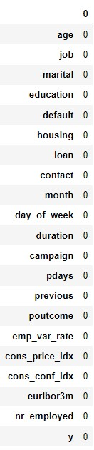

  

# **CONTENTS**

1. Background

2. Data Dictionary

3. Data Analysis

4. Process

5. Data Observation

6. Exploratory Data Analysis

7. Identifying Null Values

8. Analyzing Multicollinearity

9. Bi-Variate Analysis

10. Feature Distribution

11. Feature Engineering

12. MODELING

13. Logistic Regression

14. Decision Tree Classifier

15. Gradient Boosting Classifier

16. Random Forest

17. Result

18. K-MEANS Clustering

19. Recommendations

# 
# **BACKGROUND**

XYZ bank ran a marketing campaign driven by phone calls, in order to increase the potential clients of term deposits. The campaign ran from May 2008 to November 2010. Data was collected from this campaign to analyze the success of the campaign and to predict, whether the marketed customer will sign up for the for the term deposit or not. Furthermore, exploratory data analysis (EDA), was performed to study the relationships between the data points.

# 
# **DATA DICTIONARY**

|**Variable Name**|**Description**|**Data Type**|
| :-: | :-: | :-: |
|Age |Age of the Customer|Numeric|
|Job|Type of job |Categorical|
|Marital|Marital status |Categorical|
|Education |Education of the customer|Categorical|
|Default|Has credit in default? |Categorical|
|Housing|Has housing loan? |Categorical|
|Loan|Has personal loan? |Categorical|
|Contact|Contact communication type |Categorical|
|Month|Last contact month of year |Categorical|
|Day\_of\_week|Last contact day of the week |Categorical|
|Duration|Last contact duration, in seconds|Numeric |
|Campaign|Number of contacts performed during this campaign and for this client (includes last contact)|Numeric|
|Pdays|Number of days that passed by after the client was last contacted from a previous campaign (999 means client was not previously contacted) |Numeric|
|Previous|Number of contacts performed before this campaign and for this client |Numeric|
|Poutcome|Outcome of the previous marketing campaign |Categorical|
|Emp.var.rate|Employment variation rate - quarterly indicator |Numeric|
|Cons.price.idx|Consumer price index - monthly indicator |Numeric|
|Cons.conf.idx|Consumer confidence index - monthly indicator |Numeric|
|Euribor3m|Euribor 3 month rate - daily indicator |Numeric|
|Nr.employed|Number of employees - quarterly indicator |Numeric|

# **DATA ANALYSIS**
## **Process**                                                                                                                                       

  

## **Data Observation**

1. Number of variables: 20
    - Categorical Variables: 10
    - Numeric Variables: 10
2. Campaign Duration: 2.5 Years (May 2008- Nov 2010)
3. Number of Rows: 41,000 approximately

## **Exploratory Data Analysis**

### **Identifying Null Values**
No null values were found in the dataset.

### **Analyzing Multicollinearity**

emp.var.rate, euribor3m, nr.employed had high multicollinearity. After observing the collinearity of aforementioned variables with others, emp.var.rate, euribor3m were dropped. Below if the collinearity matrix after dropping these variables.

Dropping emp.var.rate, euribor3m successfully handled high mullticollinearity in the dataset.

### **Bi-Variate Analysis**

The above graphs shows the relationship between x-variables with y-variable. These graphs were useful to study the trend between x and y variable and how they are related.
### **Feature Distribution**

It can be observed from the above graphs that high percentage of the data is highly skewed. This problem was addressed in the modeling process.

### **Feature Engineering**

- The categorical variables were one-hot encoded, to be used in the model.
- Vector Assembler was then used to generate features to be used in the model.
- Features were then scaled using standard scaling as it enhances the performance of machine learning algorithms such as logistic regression, gradient boosting, random forest etc.
-  Weighted column was created in order to provide equal importance to each row when modeling, thus handling class imbalance. 

# **MODELING**
Four models were developed for the dataset and their AUC was compared for model selection.

|**Model**|**AUC Score**|
| :-: | :-: |
|Logistic Regression|0.9420|
|Decision Tree Classifier|0.8450|
|Gradient Boosting Classifier|0.9202|
|Random Forest|0.9446|

Analyzing all the AUC score, random forest is selected as the final model. Another reason of selecting random forest is that no variable transformation was required. Any linear model like logistic regression would require variable transformation as the dataset is highly skewed and thus results are unreliable. On the other hand, random forest being a non-linear model, can handle skewed datasets as well as outliers.

# **RESULT**

Random forest is selected as final model with high AUC score of 0.9446.

  

### **Confusion Matrix**

The following results are for the test data. It compares the actual values vs the predicted values. We can observe that the non-converted customers are correctly predicted, which is the focus of the analysis, so as to curate personalized marketing campaigns. Thus, the model is reliable.

  

### **Feature Importance**

- The feature of highest importance came out to be duration before contact with the customers. While the campaign of telephonic, it makes sense, since more is the duration, more are the chances of customer being convinced.
- The second highest important variables is the number of the employees in the bank. It portrays the standing of the company in the market and hence its reliability. 
- The important variables were further taken into consideration to build prescriptive recommendation.

  

# **K-MEANS**

  

  

- The first graph shows the optimal number of clusters i.e 3.
- The second graph shows the number of data points present in each cluster. 

  

  

  

The highest non-conversion rate is in cluster 1 (Red cluster). 
- This cluster comprises of young age people.
- The duration of contact with these people is minimum.

The second highest non-conversion cluster is cluster 2.
- The non-conversion rate in this cluster is majorly caused due to less duration of contact.

These results along with feature importance are used to build prescriptive recomendations.

# **RECOMMENDATION**

 ## 1. **Stay In Touch**
- The bank's marketing team needs to build a pipeline in order to be in constant touch with the potential customers.
- Marketing campaigns can be build incorporating newsletters, emails etc. to always stay in customers mind.
- Various schemes and offers can keep the existing customers loyal and lure potential customers to invest in the schemes.

 ## 2. **Build Trust**
- Appreciating the loyalty of customers and making them bank's brand ambassador is the easiest way to build trust amongst the potential customer.
- Incorporating non-private detail such as a customer's growth rate within the company, the journey of them benefitting from the bank's schemes and resources will not only build trust amongst the existing customers but will also lay a strong reliable foundation amongst the potential customers.
- These details can be incorporated in newsletters, Ad campaigns etc. to expand the reach.

 ## 3. **Targeted Campaigns**
-	Surveys can be held to analyze the mindset of young age people and their investment ideologies. 
-	These surveys can be further utilized to curate marketing campaigns that talks in young people’s language and build constant engagement with them. This will result in more conversion rate amongst youth (cluster 1).
-	The surveys can further be implemented on different age groups to curate  personalized  marketing campaigns
-	Marketing pitch needs to be updated as per the target audience, with different age groups ,to enhance the engagement duration (cluster 1 and 2). Higher the engagement, higher will be the conversion rate.

